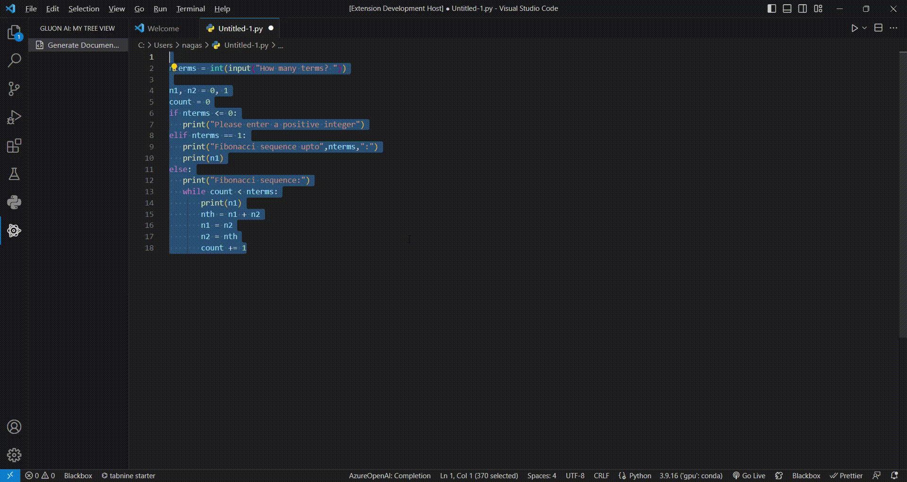

# Gluon-AI

Gluon is an AI assistant that can write documentation for you code automatically in a single click.

## Requirements

Make sure you have an OpenAI API key . Follow instruction guidelines to get one below.

## Usage

## Release Notes

Initial release

### 1.0.0

## How to get API key ?

- visit [this page](https://platform.openai.com/account/api-keys)
- click on generate new key
- copy to clipboard

## Author

😎 [Nagaraj poojari](https://github.com/nagarajRPoojari)
